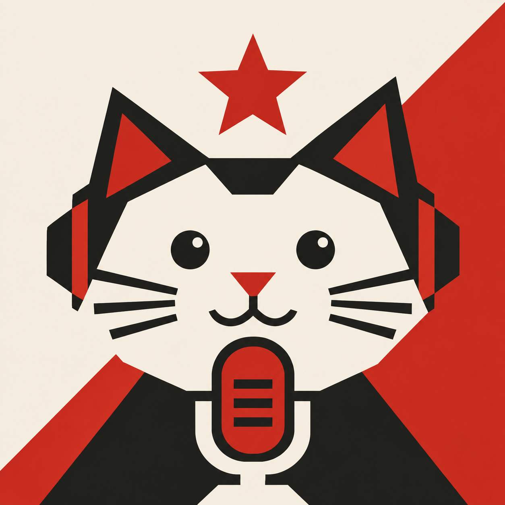

# PashaWhisper

**Small app. Big ears.** Native Mac dictation with a brutalist Soviet cute cat identity.



An early working build of the [PRD](PRD.md). See [build status](docs/BUILD_STATUS.md) for implemented features and limitations.

## Run

This repository contains the source; build the app using the **Develop** instructions below. Then open `dist/PashaWhisper.app`. A small English Whisper model is included in the generated app bundle. No Python, Homebrew, or account is needed to run the packaged app.

1. Press **Option-Space** (customizable in **Shortcuts**) or **Start Dictation**.
2. Allow microphone access when macOS asks.
3. Speak, then press your shortcut again.
4. Click **Copy Transcript** and paste into your destination app.

Shortcuts accept single keys (including Space, Escape, and F-keys), modifier-only taps, Fn/Globe, and multi-key chords. Press and release the combination to save it. Some bindings require Accessibility; use **Enable Shortcut Access** when shown. Modifier-only shortcuts trigger on release, and using a modifier to type or click does not trigger dictation. macOS may reserve some hardware/system combinations.

For an F18 pedal, choose **Shortcuts → Use F18 Pedal**, then **Test Shortcut**. The test counts shortcut presses without recording audio; click Finish Test to resume dictation. Direct assignment avoids the need to capture an event already intercepted by another app. The picker also uses an earlier system event listener when Accessibility is available and stops listening when the app loses focus.

Closing the window leaves the app in the menu bar. Use the cat menu to reopen it or quit. The first build deliberately uses manual copying; automatic insertion is not yet implemented.

Download a larger or multilingual model from Models. Choose OpenAI or Custom API under Providers to use your own key. Keys are stored in macOS Keychain. Cloud recording is always an explicit choice. API integration has not been tested against a paid live account.

No transcript history is stored. Only the current result stays in memory until cleared, replaced by another recording, or Quit. Temporary audio is deleted after success, silence, cancellation, and Quit. A failed recording can be retried during the session; crash leftovers are deleted next launch. Upgrading removes the old history and recording archive. Copied text remains on the clipboard.

The floating cat indicator displays a live microphone waveform. Enable Accessibility under **Shortcuts → Enable Field Positioning** to follow the active cursor or text field. It falls back to the pointer for unavailable fields or permission. Preview the indicator without recording from the same page.

The catalog names 13 exact Whisper variants, including Large v3 and Large v3 Turbo in explicit precisions. See the [model inventory](docs/MODELS.md) for supported artifacts and additional engine plans.

## Develop

Requires Xcode and Swift 5.9+ on Apple Silicon. Deployment target is macOS 14, but this build has only been exercised on the development Mac. CMake is a build-time dependency for preparing the bundled native engine.

```sh
bash scripts/prepare-runtime.sh
bash scripts/build-app.sh
swift test
open dist/PashaWhisper.app
```

Set `CMAKE_BIN` if CMake is installed outside PATH. Runtime sources are pinned to whisper.cpp v1.8.6, statically linked with Metal shaders embedded. No machine-specific Homebrew library paths are packaged. Downloads and native build products are excluded from Git; the bootstrap script reproduces them.

The local app is ad-hoc signed. Developer ID signing and notarization are required before distributing a production release.

## Structure

- `Sources/WhisperCore`: data, filtering, request formatting, and model catalog.
- `Sources/PashaWhisper`: native UI, audio, engine execution, model downloads, Keychain, and application lifecycle.
- `Tests/WhisperCoreTests`: regression checks for shortcut validation, display-edge placement, filtering, and API request formatting.
- `docs/BRAND.md`: visual direction, generated logo provenance, and exact prompt.
- `docs/THIRD_PARTY_NOTICES.md`: runtime and model attribution.
